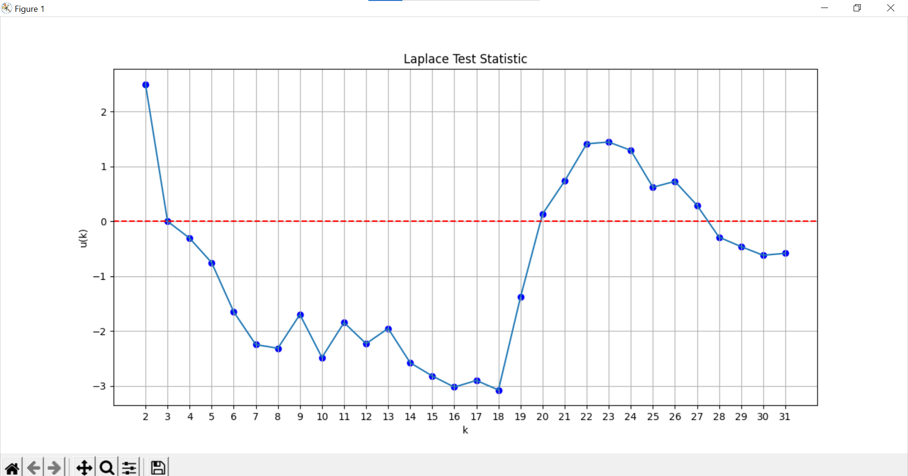

**SENG 637- Dependability and Reliability of Software Systems***

**Lab. Report \#5 – Software Reliability Assessment**

| Group \#: 15      |   |
|-----------------|---|
| Student Names:  |   |
| Sina Salimian   |   |
| Zahra Safari    |   |
| Alireza Esmaili |   |
| Sahar Hajjar Zadeh |   |
| Mehrnaz Senobari |   |
| Fatemeh Ghaffarpour |   |

# Introduction
This assignment is centered around the analysis of integration test data, specifically utilizing specialized tools aimed at assessing reliability. Our exploration will be conducted through two primary methods for evaluating failure data derived from these tests. Each method not only serves as a different approach to reliability assessment but also employs distinct tools designed for this purpose.

The first method we will explore is Reliability Growth Testing. This approach focuses on understanding how the reliability of a system evolves over time as it undergoes testing and subsequent improvements. For this method, we will use the software tool C-SFRAT. C-SFRAT is designed to help analyze and predict the reliability growth of a system based on test data, providing insights into how changes in the system design or implementation affect its reliability.

The second method involves Reliability Assessment through RDC. RDC is a graphical tool that helps in demonstrating the reliability of a system based on test results against predefined reliability targets. This method is particularly useful for verifying if a system meets the reliability requirements stipulated by stakeholders or regulatory bodies. By applying the RDC method, we can visually assess whether the tested system achieves the desired reliability levels, thereby providing a clear and effective means of communicating reliability performance to stakeholders.

Throughout this assignment, we will apply these methods to specific integration test data. By using C-SFRAT for Reliability Growth Testing and RDC for direct reliability demonstration, we aim to gain a comprehensive understanding of the reliability of the system being tested.
# 

# Assessment Using Reliability Growth Testing 
When using the C-SFRAT tool to analyze failure data, two key graphs are typically produced: the MVF graph and the Intensity graph. Each offers unique insights into system reliability during testing.

The MVF graph shows the expected cumulative number of failures over time, providing a visual representation of how reliability improves as issues are identified and corrected.

The Intensity graph depicts the rate of new failures over time, helping to assess the immediate state of system reliability. A decreasing trend in this graph suggests improvements in reliability due to effective issue resolution, whereas a plateau or increase could indicate ongoing or new issues.

Next, we select all available models, execute the estimations for each, and compare their outcomes based on their log-likelihood values. 

The log-likelihood measures how likely it is that a given model could have produced the observed data. Higher values (less negative) suggest a better fit. By comparing the log-likelihoods, we can objectively determine which models best explain the data. This approach allows for a straightforward comparison between different models, helping to choose the simplest yet effective model under the principle of parsimony.

As illustrated below, the two top-performing models are DW3 (covariates: F) and IFRGSB (covariates: E, F), which exhibit the highest log-likelihoods compared to the others.

Additionally, the model with the poorest performance (the lowest log-likelihood) is IFR SB (no covariates).

To gain a clearer insight into the functioning of our models, we select each one and display their results collectively on a single graph.

Next, we show the best two models (DW3 and IFRGSB) along with the lowest-performing model (IFR SB). In this way, we would have a better observation of each model's performance

Here is the intensity graph showcasing the top two models.

Next is the MVF graph displaying  the top two models.

### Result of Range Analysis
#### Reliability

While testing often yields a vast amount of data, not all of it is pertinent. Conducting range analysis allows us to focus only on the failure data that is relevant to our study.

One method to determine the appropriate data range for analysis is the Laplace test. This test compares the observed failure data with the expected failure data derived from a specific model. By doing so, it identifies data points that fall outside the expected range and should therefore be excluded.

However, the C-SFRAT tool lacks the capability to perform range analysis using the Laplace test or similar methods. As a workaround, we have used Python to simulate Laplace analysis, employing the formula provided in our notes. Below is the plot for Laplace analysis.

After analyzing the plotted results, we observed improvements in reliability between intervals 3-18 and 27-31. Typically, a Laplace factor ranging from -2 to 2 suggests stable reliability, indicating that our data achieves stable reliability starting from the 19th interval onward. Additionally, negative Laplace factor values signify a decline in failure intensity, while positive values indicate an increase. Our data shows negative Laplace values between intervals 3-20 and 28-31. Consequently, a suitable range containing a sufficient number of data points for analysis would be from interval 1 to 20.

#### Failure rate
Next, we present the plot for the failure rate from intervals 2 to 31. We excluded the first interval because the results significantly differed from the subsequent intervals, which could skew the overall assessment of the failure rate.

The failure rate plot provides crucial insights into the system's operational reliability over time. From the data visualized, it is evident that after an initial period of fluctuation, the failure rate stabilizes and becomes consistent and predictable. 

### Prediction
Regarding our prediction, we have established a failure intensity rate of 1.3 based on the plot above. As indicated, this rate is expected to be reached within a single interval.

## Advantages and Disadvantages of Reliability Growth Analysis
- ## Advantages
  - Identifies and corrects failures early, enhancing product reliability.
  - Provides data-driven insights for resource allocation.
  - It is suitable with complex systems or products.
  - Predicts when reliability goals will be achieved to better plan production.

- ## Disadvantages
  - Consumes significant time and data, which can delay projects.
  - Reliability of analysis is tied to the accuracy and completeness of data.
  - Requires specialized knowledge and can be challenging to implement.
  - Can lead to unrealistic expectations if not all variables are accounted for.

# Assessment Using Reliability Demonstration Chart 

# 

# Comparison of Results

# Discussion on Similarity and Differences of the Two Techniques

# How the team work/effort was divided and managed

# 

# Difficulties encountered, challenges overcome, and lessons learned

# Comments/feedback on the lab itself
